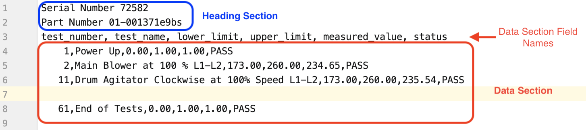

# c2m
## Introduction
**c2m** -abbreviation for **c**sv to **m**qtt- is a general-purpose, configurable command-line interface (CLI) tool for publishing data 
from comma-separated values (CSV) files to a MQTT server

## Features
- Flexible means of composing data from three sources of a file, namely:
        
    * **name** - the name of the file
    * **heading** - the section of the file that would normally appear at the top of the file before the data section
    * **data** - the section of the file with repeating rows of data with an optional data field names
	
	
	**File Sections Diagram**


- Allows for a reduced time in the publishing of data by actively watching for new files added to a specified directory
- Keeps a list of published files to avoid data republication 

## Usage
### Help
To view and understand the sub-command and options available, simply run

	c2m --help

Sample Output

```shell
c2m [--config=string] [--src=string] [--pretty] [--watch]

Description:
    A customizable tool for publishing the contents of CSV files to a MQTT message broker

Options:
    -c, --config   full path to a configuration file
    -s, --src      path to the directory containing files to be published
    -p, --pretty   to have JSON data properly formatted
    -w, --watch    to actively watch for new files in the source directory

Sub-commands:
    c2m version    print mp version
    c2m health     reports the status of the message broker
    c2m dry-run    Processes the files and dumps the output to the console without publishing to the broker
    c2m run        Processes the files and publishes to the message broker
```


### Run
The example below runs with a config file named **config-labview.yml** and publishes data from matching files in the **labview-results** directory. It continuous watches for newly added files for processing.

    c2m run -c config-labview.yml -s ./labview-results --watch

	
